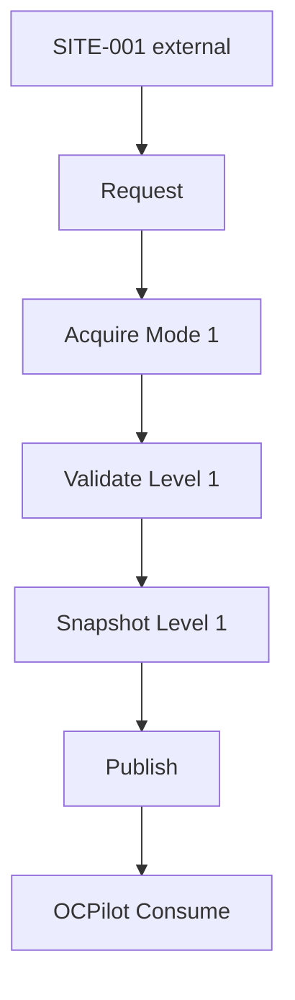

# EAR SITE-001 Workflow Example v1

**Purpose:** Illustrate [EAR-ACQUISITION-WORKFLOW-v1.md](EAR-ACQUISITION-WORKFLOW-v1.md) applied to **SITE-001** only — documentation walkthrough, **not** runtime execution.  
**Status:** example — **no** credentials, connectors, or live acquisition claimed.  
**Phase:** 2B  
**Consumer:** OCPilot (Run 5 read-only audit context)

---

## Example scope

| Field | Example value |
|-------|----------------|
| `site_id` | `SITE-001` |
| Platform | ocStore / OpenCart (test environment) |
| Acquisition mode | **1 — Guided Evidence** (operator fulfills EAR artifact list) |
| Target quality | **Level 1** — Identity + structure |
| Consumer | OCPilot |
| Baseline | `ocstore-3038-rs2` (consumer registry) |

This example does **not** perform acquisition. It shows stage-by-stage expectations.

---

## Flow overview

```
SITE-001
    ↓
Request (Run 5 charter, Mode 1, Level 1 target)
    ↓
Acquire (operator delivers guided artifacts)
    ↓
Validate (contract + Level 1 gates)
    ↓
Snapshot Level 1 (published package)
    ↓
Publish (OCPilot-visible reference)
    ↓
OCPilot Consume (structural audit phases allowed per guide)
```



---

## Stage walkthrough

### Request

| Item | Example |
|------|---------|
| Operator action | Approves SITE-001 test audit; selects Mode 1; targets Level 1 for Run 5 resume |
| EAR action | Issues guided artifact list: version proof files, root folder listing, DB prefix/table list or explicit safe-unknown, theme name or safe-unknown |
| Output | Logical request record: `site_id=SITE-001`, `consumer_target=ocpilot`, `quality_target=1`, `ear_mode=1` |
| Blockers | Mode 3 not requested; scope excludes production write |

**Credentials:** Operator holds FTP/DB access externally — **not** in request record in git.

---

### Acquire

| Item | Example |
|------|---------|
| Operator action | Collects files per guided list via approved channels (e.g. panel export, manual tree listing) — **no** EAR connector in this example |
| EAR action | Assembles candidate OpenCart package: `metadata/`, partial `file-manifest/`, `database-metadata/` or `safe-unknown`, `acquisition-log` |
| Output | Candidate `snapshot_id` e.g. `snap-20260601-site-001-run5-p1` |
| Gaps | ocMod inventory not collected → `safe-unknown` entry `section: ocmod-inventory` |

**SITE role:** Passive source; no EAR analysis on live site.

---

### Validate

| Item | Example |
|------|---------|
| EAR checks | `ear-opencart-snapshot-v1`; Level 1 minimum sections or honest `safe-unknown`; no secrets in package; `site_id` matches SITE-001 |
| Operator | Go for Store/Publish at Level 1 |
| Result | **Pass** at Level 1 (not Level 3 — extension risk phases remain consumer-blocked or partial) |

If manifest insufficient for version proof → **fail** or downgrade to Level 0 — **no publish** at Level 1 claim.

---

### Store

| Item | Example |
|------|---------|
| Operator | Places bulk manifest ZIP in external bulk (conceptual); records `bulk_root` reference in metadata |
| EAR | Documents storage class references only |
| Rule | `snap-20260601-site-001-run5-p1` immutable |

---

### Publish → Snapshot Level 1

| Item | Example |
|------|---------|
| Published package | Level 1 OpenCart Snapshot per [EAR-OPENCART-SNAPSHOT-SPEC-v1.md](EAR-OPENCART-SNAPSHOT-SPEC-v1.md) |
| Metadata highlights | `quality_level: 1`, `ear_mode: 1`, `baseline_ref: ocstore-3038-rs2`, `consumer_target: ocpilot` |
| Handoff | OCPilot receives published reference — **no** FTP password file |

---

### OCPilot Consume

| Item | Example |
|------|---------|
| Intake | Published snapshot only — per [EAR-OPENCART-CONSUMER-GUIDE-v1.md](EAR-OPENCART-CONSUMER-GUIDE-v1.md) |
| Allowed | Structural audit, baseline diff **if** manifest sufficient |
| Blocked / partial | Extension risk phases if `ocmod-inventory` in `safe-unknown` |
| Reports | Reference `snap-20260601-site-001-run5-p1` and quality level 1 |

**Run 5 note:** Run 5 remains paused until Level 1+ `file-manifest` minimum exists — this example shows the **path**, not completion.

---

### Archive (future)

When `snap-…-p2` supersedes `p1` at higher quality, `p1` moves to Archive; OCPilot reports remain tied to cited `snapshot_id`.

---

## What this example is not

| Not included | Reason |
|--------------|--------|
| Real FTP/SSH/DB steps | Phase 2B is workflow only |
| Credentials or hostnames | Security model |
| Connector execution | Mode 2 not implemented |
| OCPilot report content | Consumer-owned |

---

## Partial re-entry example (abbreviated)

```
p1: Level 1 published → OCPilot finds extension gap
    → Request (scoped: extension-inventory only)
    → Acquire p2
    → Validate Level 2
    → Publish snap-…-p2
    → OCPilot resumes blocked phases
```

---

## Cross-references

| Document | Use |
|----------|-----|
| [projects/ocpilot/freeze/site-001-pre-runtime-bridge/](../../projects/ocpilot/freeze/site-001-pre-runtime-bridge/) | Blockers B-EV-* |
| [EAR-ACQUISITION-MODES-v1.md](EAR-ACQUISITION-MODES-v1.md) | Mode 1 detail |
| [EAR-READINESS-GATES-v1.md](EAR-READINESS-GATES-v1.md) | Gates G0–G4 |

---

## SAFE UNKNOWN

- Actual `snapshot_id` date and Run id — illustrative prefix only
- Whether SITE-001 first publish uses Mode 0 or 1 — operator choice at Request
