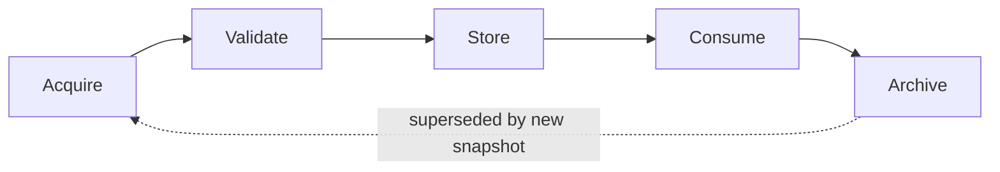

# EAR Snapshot Lifecycle v1

**Purpose:** Define the **lifecycle stages** of a Snapshot Package from acquisition through archive — responsibilities only, **no** implementation.  
**Status:** architecture specification  
**Phase:** 2A — complements [EAR-OPENCART-SNAPSHOT-SPEC-v1.md](EAR-OPENCART-SNAPSHOT-SPEC-v1.md)  
**Applies to:** OpenCart / ocStore packages first; other platforms should align conceptually until Phase 4 unification.

---

## Lifecycle overview

```
Acquire  →  Validate  →  Store  →  Consume  →  Archive
```

Each stage has a **primary owner** and explicit **outputs**. Stages may be repeated (new `snapshot_id`) without mutating prior packages.



---

## Stage 1 — Acquire

**Purpose:** Collect evidence from an external SITE into a candidate Snapshot Package.

| Actor | Responsibility |
|-------|----------------|
| **Operator** | Approve target site, environment, channel, and scope (HITL); provide credentials outside git; execute or supervise collection in Mode 0–2 |
| **EAR** | Define what to collect per OpenCart spec and quality target; assemble logical sections; record `acquisition-log`; populate `safe-unknown` for gaps |
| **SITE** | Passive source — no EAR analysis on live site |

**Inputs:**

- Site charter (e.g. OCPilot SITE-001 audit charter)
- Approved acquisition mode (EAR Mode 0, 1, or 2)
- Target quality level (0–3)

**Outputs:**

- Candidate package (logical sections per spec)
- `acquisition-log` entries
- Declared `environment` and metadata claims

**Must not happen in Acquire (v1):**

- Consumer risk ratings or remediation plans
- Writes to live site (Mode 3 forbidden)
- Storing raw passwords inside the package

**SAFE UNKNOWN:** Automated connectors — not defined in this document. Process detail: [EAR-ACQUISITION-WORKFLOW-v1.md](EAR-ACQUISITION-WORKFLOW-v1.md) (Phase 2B — Request, Publish, gates).

---

## Stage 2 — Validate

**Purpose:** Confirm the candidate package meets contract and quality level before consumer handoff.

| Actor | Responsibility |
|-------|----------------|
| **Operator** | Final go/no-go on publish; confirm environment class; resolve or accept `safe-unknown` items |
| **EAR** | Check required sections for declared quality level; ensure `safe-unknown` covers gaps; reject publish if credentials leaked into package |
| **Consumer** | **Does not** validate at publish time in v1 — may validate on intake (see Stage 4) |

**Validation dimensions (conceptual checklist):**

| Check | Question |
|-------|----------|
| Contract version | Does package declare `ear-opencart-snapshot-v1`? |
| Quality level | Are all sections required for that level present or in `safe-unknown`? |
| PII policy | Is database-metadata free of row/customer content? |
| Secrets | Are credentials absent from git-bound copies? |
| Identity | Are `snapshot_id` and `site_id` unique and consistent? |
| Honesty | Does every empty critical section have a `safe-unknown` entry? |

**Outputs:**

- **Published** snapshot (approved for Store) **or**
- **Rejected** candidate with documented reasons (remains operator-held, not consumer intake)

**Failure behavior:**

- Partial packages may publish at lower quality level if operator explicitly downgrades and consumer charter allows.
- Publishing Level 2 package with Level 3 claim — **forbidden**.

---

## Stage 3 — Store

**Purpose:** Place the approved snapshot where consumers can access it **without** live site credentials.

| Actor | Responsibility |
|-------|----------------|
| **Operator** | Place bulk artifacts in agreed external storage; ensure backup policy |
| **EAR** | Document storage references in metadata (`bulk_root`); maintain acquisition registry **outside git** if used — **SAFE UNKNOWN** location |
| **Consumer** | Read-only access to published snapshot reference |

**Storage classes (conceptual):**

| Class | Contents | Typical placement |
|-------|----------|-------------------|
| **Contract slice** | Metadata, manifests, inventories — may be copied into consumer workspace |
| **Bulk payload** | Optional full trees, large manifests, XML bodies | External bulk per consumer registry |
| **Secrets** | Never part of snapshot | External `secrets/` only |

**Rules:**

- Published snapshots are **immutable** by convention — corrections require new `snapshot_id`.
- Storage paths in git repos should be references only, not secrets.

**SAFE UNKNOWN:** Checksum registry, WORM storage, encryption standards — not in v1 lifecycle.

---

## Stage 4 — Consume

**Purpose:** Consumer system performs read-only analysis using the snapshot as **sole** structural input (no default live access).

| Actor | Responsibility |
|-------|----------------|
| **Consumer (OCPilot)** | Intake contract version; honor quality level; halt phases blocked by `safe-unknown`; write reports to consumer paths |
| **Operator** | Answer consumer unblock requests; may authorize new Acquire cycle |
| **EAR** | **No** ongoing role unless re-acquisition chartered |

**Inputs:**

- Published Snapshot Package (logical + optional bulk refs)
- Consumer baseline registry (e.g. `ocstore-3038-rs2`)

**Outputs:**

- Audit reports, diff notes, risk findings — **owned by consumer**, not EAR

**Must not happen in Consume:**

- Consumer silently opening live FTP/DB using charter-blocked credentials
- Consumer upgrading quality level without new snapshot
- Consumer treating metadata claims as proven fact without corroboration

See [EAR-OPENCART-CONSUMER-GUIDE-v1.md](EAR-OPENCART-CONSUMER-GUIDE-v1.md) for OCPilot-specific rules.

---

## Stage 5 — Archive

**Purpose:** Retire snapshots from active consumer use while preserving audit history.

| Actor | Responsibility |
|-------|----------------|
| **Operator** | Decide retention; move bulk to archive tier; document supersession |
| **EAR** | Optional catalog entry — **not implemented** in v1 |
| **Consumer** | Mark reports as tied to archived `snapshot_id`; do not re-run against live site by default |

**Triggers for archive:**

- Newer snapshot supersedes (e.g. `snap-…-p2` replaces `p1`)
- Site audit closed
- Retention policy elapsed

**Rules:**

- Archive is **not** delete — operator policy governs destruction.
- Archived snapshots remain citeable from historical reports.

**SAFE UNKNOWN:** Legal hold, GDPR erasure interaction with snapshots — operator legal review, not specified here.

---

## Responsibility summary

| Stage | Operator | EAR | Consumer |
|-------|----------|-----|----------|
| **Acquire** | Approve, supervise, Mode 0 execution | Assemble, log, safe-unknown | — |
| **Validate** | Publish approval | Contract + quality checks | — |
| **Store** | Bulk placement, retention | Reference metadata | Read access only |
| **Consume** | Unblock via new acquire if needed | — | Analysis, reports |
| **Archive** | Retention, supersession | — | Historical reference |

---

## Re-entry and partial acquisition

Multiple acquisition cycles are normal:

```
Acquire (p1, Level 1) → Validate → Store → Consume (partial)
    → Acquire (p2, Level 2) → …
```

- Each cycle gets a new `snapshot_id`.
- Prior snapshots move toward **Archive** when superseded.
- Consumers must declare which `snapshot_id` a report references.

---

## Relation to EAR modes

| Mode | Lifecycle impact |
|------|------------------|
| **0 Manual** | Operator performs Acquire; EAR may only wrap at Validate if tooling exists |
| **1 Assisted** | EAR provides collection checklist during Acquire |
| **2 Connected read-only** | EAR drives Acquire under HITL — **future** |
| **3 Write** | **Out of v1 lifecycle** |

---

## Cross-references

| Document | Use |
|----------|-----|
| [EAR-OPENCART-SNAPSHOT-SPEC-v1.md](EAR-OPENCART-SNAPSHOT-SPEC-v1.md) | Package structure and quality levels |
| [EAR-MODES-v1.md](EAR-MODES-v1.md) | Mode 0–3 |
| [EAR-SECURITY-MODEL-v1.md](EAR-SECURITY-MODEL-v1.md) | Secrets and HITL |
| [EAR-ARCHITECTURE-v1.md](EAR-ARCHITECTURE-v1.md) | Layer model |

---

## SAFE UNKNOWN

- Automated Validate tooling (CLI validator) — Phase 4 candidate, not Phase 2A.
- Central snapshot registry in MARS repo — not claimed.
- Consumer notification webhooks — not in scope.
