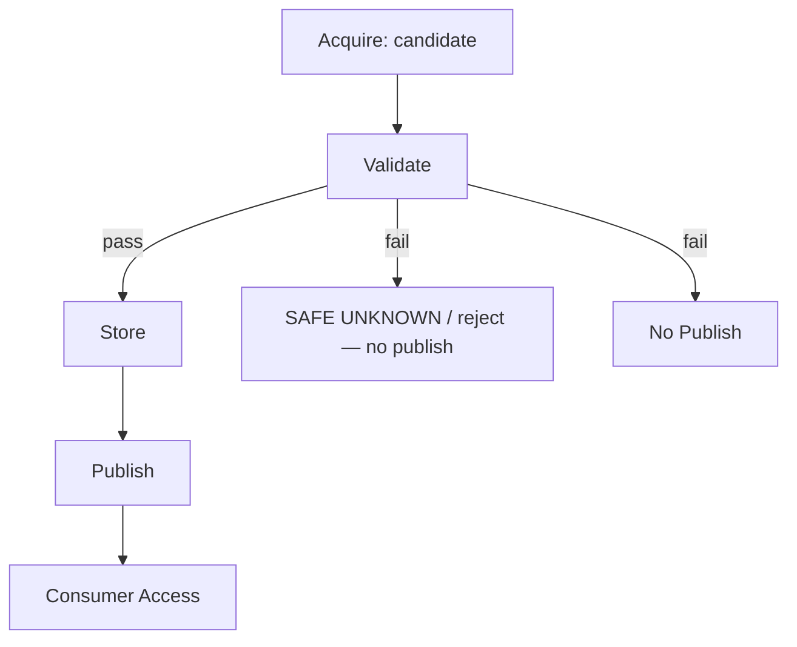

# EAR Snapshot Publishing v1

**Purpose:** Define how a validated snapshot becomes **visible** to consumers — without credentials, without consumer-driven acquisition.  
**Status:** architecture specification — **no** implementation.  
**Phase:** 2B  

---

## Publishing in the lifecycle

```
Acquire  →  Validate  →  Store  →  Publish  →  Consumer Access
```

**Publish** is the explicit gate between operator/EAR-controlled storage and consumer intake. A snapshot that is **stored** but **not published** is **not** consumer input.



---

## Core rules

| Rule | Statement |
|------|-----------|
| **No raw credentials to consumers** | Passwords, API keys, SFTP secrets, DB connection strings stay in operator external storage — never in published package or consumer git |
| **Consumers do not initiate acquisition** | Consumer charters may **request** evidence types; only Operator + EAR execute Request → Acquire |
| **Consumers consume published snapshots only** | Unpublished candidates, WinSCP folders without spec wrap, and live channel access are **out of scope** for consumer intake |
| **Publish requires Validate pass** | See [EAR-READINESS-GATES-v1.md](EAR-READINESS-GATES-v1.md) |
| **Immutability** | Published `snapshot_id` is not mutated; corrections require new acquisition cycle |

---

## Publish workflow (conceptual)

| Step | Actor | Action |
|------|-------|--------|
| 1 | EAR | Validate completes — candidate marked validated or rejected |
| 2 | Operator | Confirms storage placement per [EAR-STORAGE-MODEL-v1.md](EAR-STORAGE-MODEL-v1.md) |
| 3 | Operator | HITL **publish approval** (may coincide with validate go/no-go) |
| 4 | EAR | Records publish in metadata / acquisition-log: `published_at`, `operator_approval`, `consumer_target` |
| 5 | Consumer | Intake via published reference only (logical path or registry pointer) |

**Outputs of Publish:**

- Consumer-visible **published snapshot** identity (`snapshot_id`, contract version, quality level)
- Reference to contract slice and optional bulk root — **not** secrets
- Explicit `ear_mode` at acquisition time

---

## What consumers receive

| Included | Excluded |
|----------|----------|
| Metadata, manifests, inventories per contract | Live SITE credentials |
| `safe-unknown` honesty block | Unvalidated candidate trees |
| `bulk_root` or equivalent **reference** | Operator `secrets/` paths |
| Acquisition / access log (how evidence was obtained) | Permission to open live FTP/DB by default |

Handoff rules for OCPilot: [EAR-OPENCART-CONSUMER-GUIDE-v1.md](EAR-OPENCART-CONSUMER-GUIDE-v1.md).

---

## Publish vs Store

| Dimension | Store | Publish |
|-----------|-------|---------|
| **Audience** | Operator, EAR, backup policy | Registered consumers |
| **State** | Validated artifacts placed immutably | Consumer may begin **Consume** |
| **Failure** | Wrong tier, mutable overwrite | Skipped Validate, credential leak |
| **Consumer visibility** | May be none until Publish | Required for intake |

Store may precede Publish in time; both require Validate pass. Combining Store+Publish in one operator action is allowed if gates are satisfied.

---

## Downgrade and partial publish

| Situation | Behavior |
|-----------|----------|
| Operator downgrades declared quality at Validate | Publish at **lower** level; metadata must match |
| Claim Level 3 with Level 1 evidence | **Forbidden** — Validate fails, no Publish |
| Partial acquisition (`p1`) | Publish allowed at declared level; consumer phases may halt on `safe-unknown` |

---

## Consumer access (after Publish)

```
Published Snapshot  →  Consumer Intake  →  Analysis  →  Reports
```

- Consumer validates contract version on **intake** (consumer-side), distinct from EAR Validate at publish time.
- Consumer **must** reference `snapshot_id` in all reports.
- Re-acquisition: new cycle from **Request** — consumer does not pull from SITE directly.

---

## Failure and SAFE UNKNOWN

| Condition | EAR / operator behavior |
|-----------|-------------------------|
| Validate failed | **No Publish**; candidate remains operator-held; document reasons |
| Ambiguous validate | Treat as fail → **SAFE UNKNOWN** → no publish until operator resolves |
| Consumer asks for “latest live” | **Reject** — offer new Request/Acquire or cite published `snapshot_id` |
| Publish notification automation | **SAFE UNKNOWN** — not in v1 |

---

## Cross-references

| Document | Use |
|----------|-----|
| [EAR-ACQUISITION-WORKFLOW-v1.md](EAR-ACQUISITION-WORKFLOW-v1.md) | Full lifecycle |
| [EAR-READINESS-GATES-v1.md](EAR-READINESS-GATES-v1.md) | Gate before Publish |
| [EAR-FAILURE-MODELS-v1.md](EAR-FAILURE-MODELS-v1.md) | Failed validation |

---

## Non-goals

- Consumer subscription APIs
- Automatic publish on Acquire complete
- Credential escrow for consumers
