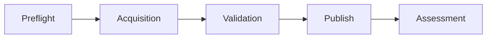

# PILOT-001 — Execution Preparation Plan v1

**Type:** Planning document only — stages and gates, no execution detail  
**Phase:** 6 — Implementation Sub-Charter  
**Date:** 2026-06-01  
**Pilot ID:** `PILOT-001`  
**Companion:** [IMPLEMENTATION-SUBCHARTER-v1.md](IMPLEMENTATION-SUBCHARTER-v1.md)

**This document does not contain:** connector implementation steps, SFTP commands, runtime configuration, scripts, or live-access procedures.

**Purpose:** Define the **ordered preparation stages** an operator follows **after** Implementation Sub-Charter authorization and **before** any Execution authorization — and the **assessment** closeout after a future controlled execution (if ever authorized).

---

## 1. Preconditions (planning context)

| Prerequisite | Status at Phase 6 |
|--------------|-------------------|
| [PILOT-CHARTER-v1.md](PILOT-CHARTER-v1.md) complete | **Yes** |
| Phase 5 **CONDITIONAL GO** | **Yes** |
| [IMPLEMENTATION-SUBCHARTER-v1.md](IMPLEMENTATION-SUBCHARTER-v1.md) drafted | **Yes** |
| Operator Approval (STATUS) | **No** |
| Implementation Authorization (sub-charter §10) | **No** |
| Execution Authorization | **No** |

**No stage below may be treated as "go" for live access** until Execution Authorization and [IMPLEMENTATION-SUBCHARTER-v1.md](IMPLEMENTATION-SUBCHARTER-v1.md) §7 checklist items are satisfied.

---

## 2. Stage overview

| Stage | EAR workflow alignment | Phase 6 content |
|-------|------------------------|-----------------|
| **Preflight** | Pre-Request / G0 operator gates | Requirements and readiness only |
| **Acquisition** | Acquire | Intent and boundaries only — **no** connector steps |
| **Validation** | Validate | Gate intent (G1–G4) — **no** procedure |
| **Publish** | Publish | HITL and honesty rules — **no** publish action |
| **Assessment** | Post-execution pilot assessment | Criteria reference — **no** execution assumed |

Canonical workflow: [EAR-ACQUISITION-WORKFLOW-v1.md](../../EAR-ACQUISITION-WORKFLOW-v1.md).

---

## 3. Preflight (preparation)

**Goal:** Confirm operator bindings, governance gates, and safety prerequisites before any Execution charter.

| Planning element | Source | Phase 6 |
|------------------|--------|---------|
| Operator Approval recorded | [STATUS.md](STATUS.md), sub-charter §5 | **Required** — not met |
| Operational paths resolved | Sub-charter §4 | **SAFE UNKNOWN** |
| Preflight requirements | Sub-charter §6 | Documented |
| Execution readiness checklist | Sub-charter §7 | Mostly **NO** / **SAFE UNKNOWN** |
| Stop conditions understood | [STOP-CONDITIONS-v1.md](STOP-CONDITIONS-v1.md) | Incorporated by reference |
| Request (G0) alignment | [PILOT-CHARTER-v1.md](PILOT-CHARTER-v1.md) §6 | `req-pilot-001-site-001-v1` |

**Outcomes (future, if Execution authorized):** Go / No-Go / Defer — human-recorded only. **Not** defined in Phase 6.

**Forbidden in Preflight planning phase:** Live SFTP, credential values in git, claiming preflight complete while §4 is SAFE UNKNOWN.

---

## 4. Acquisition (preparation)

**Goal:** Plan read-only acquisition that could support honest Snapshot Level 1 via CON-L1-A — **without** performing acquisition in Phase 6.

| Planning element | Reference |
|------------------|-----------|
| Track | Connected Acquisition — [EAR-CONNECTED-ACQUISITION-v1.md](../../EAR-CONNECTED-ACQUISITION-v1.md) |
| Path | CON-L1-A — [EAR-CONNECTED-PATHS-v1.md](../../EAR-CONNECTED-PATHS-v1.md) |
| Mode | Mode 2 — [EAR-MODE-2-OPENCART-REFERENCE-v1.md](../../EAR-MODE-2-OPENCART-REFERENCE-v1.md) |
| Connector class | SFTP Read-Only — [EAR-CONNECTOR-TYPES-v1.md](../../EAR-CONNECTOR-TYPES-v1.md) |
| Quality cap | Level 1 — [EAR-OPENCART-QUALITY-MAPPING-v1.md](../../EAR-OPENCART-QUALITY-MAPPING-v1.md) |
| Partial / safe-unknown semantics | [EAR-CONNECTOR-CONTRACT-v1.md](../../EAR-CONNECTOR-CONTRACT-v1.md) |
| Evidence vs snapshot | [EAR-EVIDENCE-PACKAGE-v1.md](../../EAR-EVIDENCE-PACKAGE-v1.md) |

**Planning outputs (future implementation/execution phases):** acquisition scope document, acquisition log fields (SC-17), evidence quarantine handoff.

**Explicitly excluded from this plan:** connector code, transfer commands, session management, automation.

---

## 5. Validation (preparation)

**Goal:** Plan manual Validate (G1–G4) ownership and Level 1 evidence checks — **no** validation run in Phase 6.

| Planning element | Reference |
|------------------|-----------|
| Validate owner | **SAFE UNKNOWN** — sub-charter §5.3 |
| Level 1 checklist | [SUCCESS-CRITERIA-v1.md](SUCCESS-CRITERIA-v1.md), [EAR-OPENCART-QUALITY-MAPPING-v1.md](../../EAR-OPENCART-QUALITY-MAPPING-v1.md) |
| Redaction | [EAR-OPENCART-READINESS-CHECKLIST-v1.md](../../EAR-OPENCART-READINESS-CHECKLIST-v1.md) item 17 |
| Fail-closed publish | [EAR-READINESS-GATES-v1.md](../../EAR-READINESS-GATES-v1.md), stop conditions |
| Waived risks | [RISK-REGISTER-v1.md](RISK-REGISTER-v1.md) |

**Planning principle:** No publish if validation fails or level would be inflated.

---

## 6. Publish (preparation)

**Goal:** Plan HITL publish gate and consumer-visible snapshot policy — **no** publish in Phase 6.

| Planning element | Reference |
|------------------|-----------|
| Publish gate | [EAR-SNAPSHOT-PUBLISHING-v1.md](../../EAR-SNAPSHOT-PUBLISHING-v1.md) |
| Lifecycle | [EAR-SNAPSHOT-LIFECYCLE-v1.md](../../EAR-SNAPSHOT-LIFECYCLE-v1.md) |
| `publish_location` | **SAFE UNKNOWN** — sub-charter §4 |
| Consumer intake | [EAR-OPENCART-CONSUMER-GUIDE-v1.md](../../EAR-OPENCART-CONSUMER-GUIDE-v1.md) |
| OCPilot honesty | Run 5 **not** complete until separately assessed |

**Planning principle:** TEST metadata (`site_id`, `environment`, baseline) must accompany any future publish.

---

## 7. Assessment (preparation)

**Goal:** Define how pilot success will be judged **if** a future execution occurs — assessment itself is **not** run in Phase 6.

| Planning element | Reference |
|------------------|-----------|
| Assessment plan | [PILOT-001-SITE-001-ASSESSMENT-PLAN-v1.md](../../PILOT-001-SITE-001-ASSESSMENT-PLAN-v1.md) |
| Pass/fail criteria | [SUCCESS-CRITERIA-v1.md](SUCCESS-CRITERIA-v1.md) |
| Evidence taxonomy | Assessment plan — SAFE UNKNOWNs listed |
| Lessons learned placeholder | [LESSONS-LEARNED.md](LESSONS-LEARNED.md) |
| Assessment Acceptance gate | Sub-charter §5 — human only |

**Phase 6 outcome:** Assessment **planning** aligned to charter; **no** pass/fail recorded.

---

## 8. Phase 7 handoff (planning pointer)

Recommended next operational phase: **Execution Preparation Review** — see [PHASE-6-DECISION-v1.md](PHASE-6-DECISION-v1.md).

| Phase 7 intent (planned) | Not in Phase 6 |
|--------------------------|----------------|
| Review sub-charter vs requirements checklist | Resolve §4 bindings |
| Confirm Execution Authorization criteria | Live access decision |
| Optional implementation task charter | Connector code |

---

## 9. Truth statement

| Claim | Accurate? |
|-------|-----------|
| This plan executes the pilot | **No** |
| Acquisition stage includes SFTP steps | **No** |
| Publish will occur under Phase 6 | **No** |
| Assessment completed | **No** |
